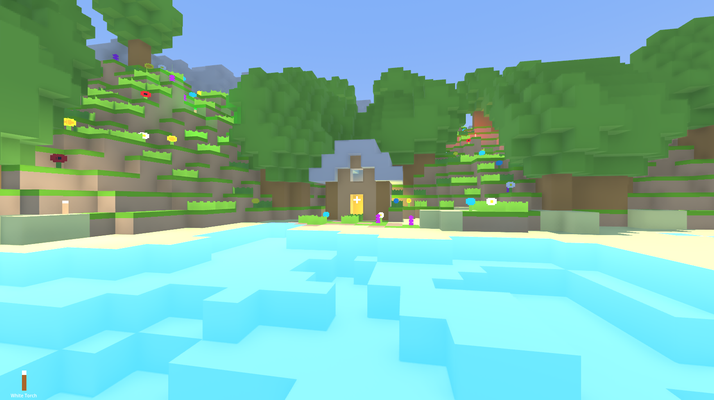

# GDCraft

Tiny Minecraft clone in Godot using GDScript

# Features

- Procedural world generation
- Asynchronous chunk loading
- Blocks and plants
- Point lights
- Persistent worlds
- Day night cycle
